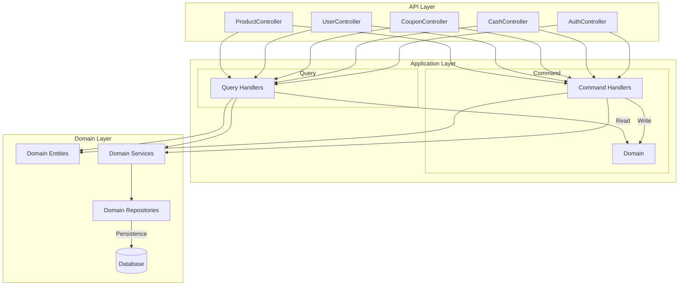
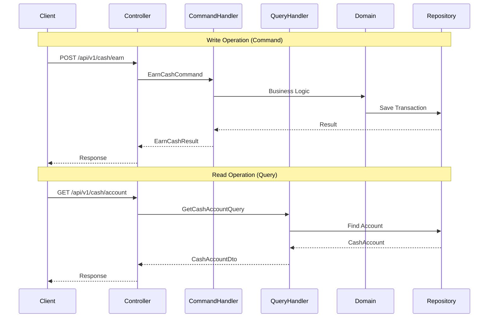
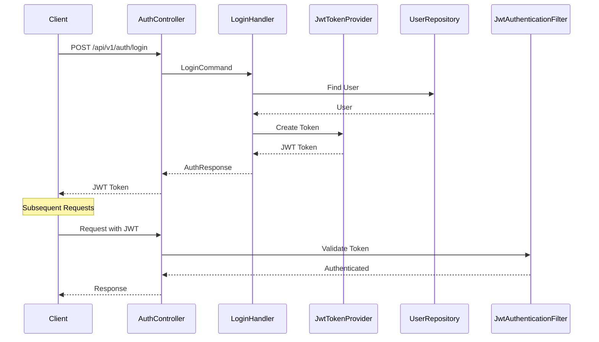
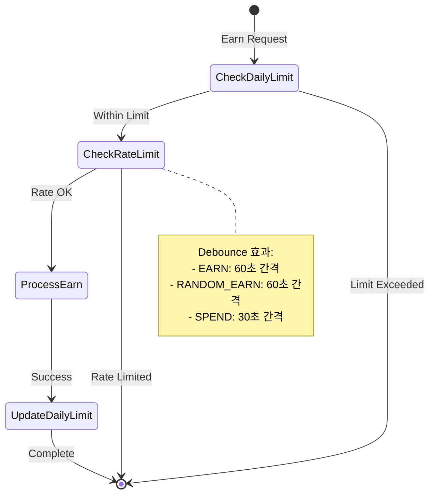
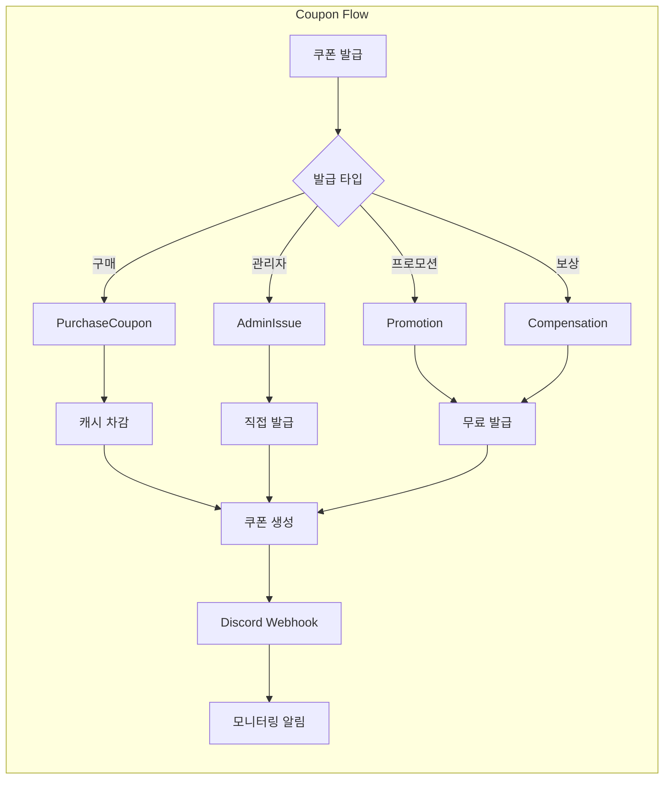

# CashKeyboard API

캐시 적립 및 쿠폰 관리 시스템을 위한 RESTful API 서버입니다.

## 📋 목차

- [기술 스택](#기술-스택)
- [아키텍처](#아키텍처)
- [주요 기능](#주요-기능)
- [프로젝트 구조](#프로젝트-구조)
- [시작하기](#시작하기)

## 🛠 기술 스택

- **언어**: Kotlin 1.9.25
- **프레임워크**: Spring Boot 3.1.5
- **데이터베이스**: PostgreSQL, H2 (개발용)
- **인증**: JWT (JSON Web Token)
- **API 문서**: SpringDoc OpenAPI (Swagger UI)
- **빌드 도구**: Gradle (Kotlin DSL)

## 🏗 아키텍처

### DDD 기반 레이어드 아키텍처

확장성 확보를 위해 Domain-Driven Design(DDD) 기반의 레이어드 아키텍처를 적용했습니다.



### CQRS 패턴

읽기/쓰기 작업 부하 분산을 위해 Command Query Responsibility Segregation(CQRS) 패턴을 도입했습니다.



## ✨ 주요 기능

### 1. JWT 기반 인증 시스템

- JWT 토큰 기반 인증 및 인가
- 사용자 정보 CRUD 관리
- 디바이스 토큰 관리 (FCM 푸시 알림용)



### 2. 캐시 적립 시스템

- 일일 한도 관리 (최대 적립 금액 및 횟수 제한)
- Rate Limiting을 통한 배치 처리 (debounce 효과)
- 랜덤 적립 시스템 (확률 기반 보상)



**일일 한도 설정:**
- 최대 적립 금액: 1,000원
- 최대 적립 횟수: 20회
- 최대 랜덤 적립 횟수: 10회

**Rate Limiting:**
- 일반 적립: 60초 간격
- 랜덤 적립: 60초 간격
- 캐시 사용: 30초 간격

### 3. 쿠폰 관리 시스템

- 쿠폰 구매 및 사용
- 관리자 쿠폰 발급
- 쿠폰 통계 조회
- 웹훅 기반 Discord 연동 (쿠폰 발급 현황 모니터링)



### 4. 사용자 및 디바이스 토큰 관리

- 사용자 프로필 관리
- 다중 디바이스 토큰 지원
- FCM 푸시 알림을 위한 디바이스 토큰 저장 및 관리

## 📁 프로젝트 구조

```
src/main/kotlin/net/cashkeyboard/server/
├── auth/                    # 인증 도메인
│   ├── api/                # API 레이어
│   │   ├── dto/            # 요청/응답 DTO
│   │   └── v1/             # API 버전 관리
│   ├── application/        # 애플리케이션 레이어
│   │   └── command/        # Command 핸들러
│   ├── domain/             # 도메인 레이어
│   └── exception/          # 도메인 예외
│
├── cash/                   # 캐시 도메인
│   ├── api/
│   ├── application/
│   │   ├── command/        # 쓰기 작업 (CQRS)
│   │   ├── query/          # 읽기 작업 (CQRS)
│   │   └── service/        # 애플리케이션 서비스
│   └── domain/
│       ├── service/         # 도메인 서비스
│       └── exception/
│
├── coupon/                 # 쿠폰 도메인
│   ├── api/
│   ├── application/
│   │   ├── command/
│   │   └── query/
│   └── domain/
│
├── product/                # 상품 도메인
│   ├── api/
│   ├── application/
│   └── domain/
│
├── user/                   # 사용자 도메인
│   ├── api/
│   ├── application/
│   │   ├── command/
│   │   └── query/
│   └── domain/
│
└── common/                 # 공통 모듈
    ├── config/             # 설정
    ├── domain/             # 공통 도메인
    ├── errors/             # 에러 처리
    ├── security/           # 보안
    └── validation/         # 검증
```

### 레이어별 역할

**API Layer (`api/`)**
- HTTP 요청/응답 처리
- DTO 변환
- API 버전 관리

**Application Layer (`application/`)**
- 비즈니스 로직 조율
- Command/Query 분리 (CQRS)
- 트랜잭션 관리

**Domain Layer (`domain/`)**
- 핵심 비즈니스 로직
- 도메인 엔티티 및 값 객체
- 도메인 서비스
- 리포지토리 인터페이스

## 🚀 시작하기

### 사전 요구사항

- JDK 17 이상
- PostgreSQL (또는 H2 for 개발)
- Gradle

### 설정

1. **저장소 클론**
```bash
git clone <repository-url>
cd cashkeyboard-api
```

2. **데이터베이스 설정**

`src/main/resources/application.yml` 파일을 수정하여 데이터베이스 연결 정보를 설정합니다.

```yaml
spring:
  datasource:
    url: jdbc:postgresql://localhost:5432/cashkeyboard
    username: postgres
    password: postgres
```

3. **애플리케이션 실행**

```bash
./gradlew bootRun
```

또는

```bash
./gradlew build
java -jar build/libs/cashkeyboard-api-0.0.1-SNAPSHOT.jar
```

### API 문서

애플리케이션 실행 후 다음 URL에서 API 문서를 확인할 수 있습니다:

- Swagger UI: http://localhost:8080/swagger-ui.html
- OpenAPI JSON: http://localhost:8080/api-docs

### 주요 엔드포인트

**인증**
- `POST /api/v1/auth/login` - 로그인 및 JWT 토큰 발급

**캐시**
- `POST /api/v1/users/{userId}/cash/earn` - 캐시 적립
- `POST /api/v1/users/{userId}/cash/random-earn` - 랜덤 캐시 적립
- `POST /api/v1/users/{userId}/cash/spend` - 캐시 사용
- `GET /api/v1/users/{userId}/cash/account` - 캐시 계정 조회
- `GET /api/v1/users/{userId}/cash/transactions` - 거래 내역 조회

**쿠폰**
- `GET /api/v1/coupons` - 쿠폰 목록 조회
- `POST /api/v1/coupons/purchase` - 쿠폰 구매
- `POST /api/v1/coupons/{couponId}/use` - 쿠폰 사용
- `GET /api/v1/admin/coupons/statistics` - 쿠폰 통계 (관리자)

**사용자**
- `POST /api/v1/users` - 사용자 생성
- `GET /api/v1/users/{userId}` - 사용자 정보 조회
- `PUT /api/v1/users/{userId}/profile` - 프로필 수정
- `PUT /api/v1/users/{userId}/device-token` - 디바이스 토큰 업데이트

## 🔒 보안

- JWT 토큰 기반 인증
- BCrypt를 사용한 비밀번호 암호화
- 관리자 API는 별도의 Secret Key 인증
- CORS 설정 지원

## 📝 라이선스

이 프로젝트는 비공개 프로젝트입니다.

